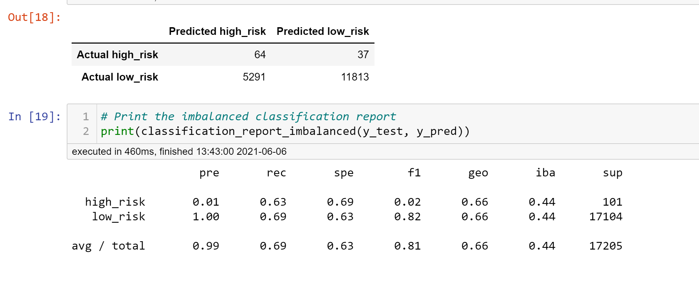

# Overview of the analysis

- To apply machine learning to solve a real-world challenge: credit card risk. Credit risk is an inherently unbalanced classification problem, as good loans easily outnumber risky loans. Using the credit card credit dataset from LendingClub, a peer-to-peer lending services company, I will oversample the data using the RandomOverSampler and SMOTE algorithms, and undersample the data using the ClusterCentroids algorithm. Then, use a combinatorial approach of over- and undersampling using the SMOTEENN algorithm. Next, I will compare two new machine learning models that reduce bias, BalancedRandomForestClassifier and EasyEnsembleClassifier, to predict credit risk. 

# Results

- Naive Random Oversampling

- SMOTE Oversampling

- Undersampling

- SMOTEENN Model

- Balanced Random Forest Classifier

- Easy Ensemble AdaBoost Classifier

# Summary 

- The Naive Random Oversampling balanced accuracy score is 65% and an F1 of 2% only.

- The SMOTE Oversampling balanced accuracy score is 66% and an F1 of 2% only.

- The Undersampling balanced accuracy score is 54% and an F1 of 1% only.

- The SMOTEENN model balanced accuracy score is 65% and an F1 of 2% only.

- The Balanced Random Forest Classifier accuracy score is 79% and an F1 of 1% only.

- The Easy Ensemble AdaBoost Classifier accuracy score is 65% and an F1 of 2% only.

- The Balanced Random Forest Classifier, with and without AdaBoost, failed to achieve useable performance. All the models used to perform the credit risk analysis show weak precision in determining if a credit risk is high. I would not recommend the bank to use any of these models to predict credit risk.

